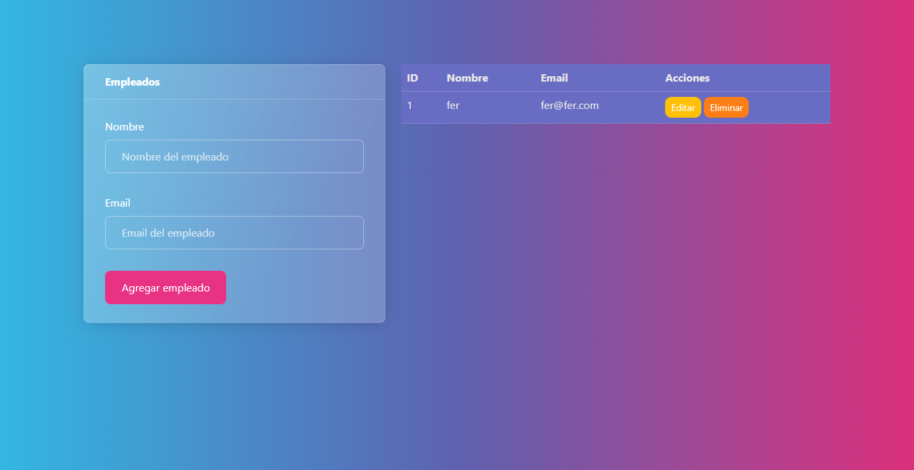

# 🧑‍💻 CRUD de Empleados con JavaScript Puro y Bootstrap

Un simple proyecto de aplicación **CRUD** (*Create, Read, Update, Delete*) para gestionar una lista de empleados. La aplicación está desarrollada utilizando exclusivamente **HTML, CSS, JavaScript (Vanilla JS)** y el framework **Bootstrap** para el estilizado.

---

## 🚀 Tecnologías Utilizadas

| Tecnología | Propósito | Notas |
| :--- | :--- | :--- |
| **HTML5** | Estructura principal y semántica. | Definición del formulario, tabla y modal de edición. |
| **JavaScript (Vanilla JS)** | Lógica de la aplicación (CRUD). | Manejo del DOM, gestión de eventos y persistencia de datos (en memoria). |
| **Bootstrap 5** | Estilizado y Componentes. | Diseño responsivo, *Cards*, *Tablas* y el componente **Modal** para la edición. |
| **CSS3** | Estilos adicionales. | Personalización del fondo y colores de texto (definido en `styles.css`). |

---

## ✨ Características y Funcionalidad

Este proyecto demuestra una implementación de CRUD de gestión de datos en el *frontend* (en memoria, no hay base de datos).

### Create (Crear)
* Permite añadir nuevos empleados a la tabla usando el formulario lateral.
* La acción se activa al hacer clic en el botón "Agregar empleado" o al presionar la tecla **`Enter`** en cualquiera de los campos de entrada del formulario.

### Read (Leer)
* Muestra la lista completa de empleados en una tabla dinámica en el panel derecho.
* Cada empleado tiene un **ID** generado automáticamente.

### Update (Actualizar)
* Los datos pueden modificarse haciendo clic en el botón "Editar".
* Se utiliza un **Modal de Bootstrap** para cargar los datos actuales del empleado y permitir la edición.
* La actualización se ejecuta al presionar "Guardar cambios" o la tecla **`Enter`** dentro del modal.

### Delete (Eliminar)
* Permite borrar una fila de empleado con un *prompt* de confirmación para evitar eliminaciones accidentales.

---

## ⚙️ Explicación Técnica (Detalles de Implementación)

La lógica central de la aplicación está contenida en el bloque `<script>` dentro de `index.html`, demostrando manipulación directa del DOM con Vanilla JS.

### 1. Manejo de Eventos (Delegación Implícita)
* Se utiliza un *event listener* en el `document` para capturar clics. Esto permite **manejar eficientemente** las acciones de **Editar** y **Eliminar** sin tener que agregar un *listener* a cada nueva fila de la tabla creada.
* La identificación de la acción se realiza verificando las clases CSS del elemento objetivo (`e.target.classList.contains(...)`).

### 2. Edición de Datos y Referencias
* Al iniciar la edición, la variable global **`empleadoActual`** almacena una referencia directa al elemento **`<tr>`** (la fila de la tabla) que se está modificando.
* Al guardar los cambios, se actualiza directamente el **`innerText`** de las celdas de la fila referenciada, lo cual es una técnica rápida de Vanilla JS para la manipulación del DOM.

### 3. Persistencia de Datos
* La lista de empleados se mantiene exclusivamente en la **estructura DOM de la tabla**.
* Se utiliza una variable **`contadorID`** para asignar un ID único a cada fila (`data-id` y la celda `<td>`), garantizando identificadores secuenciales.

---

## 🖥️ Cómo Ejecutar el Proyecto

Este es un proyecto puramente *frontend* y no requiere ninguna configuración de servidor.

1.  Clona el repositorio:
    ```bash
    git clone [https://docs.github.com/es/repositories/creating-and-managing-repositories/quickstart-for-repositories](https://docs.github.com/es/repositories/creating-and-managing-repositories/quickstart-for-repositories)
    ```
2.  Navega a la carpeta del proyecto.
3.  Abre el archivo `index.html` directamente en tu navegador.
````

## 🖥️ Vista Previa

<p align="center">
  
</p>
